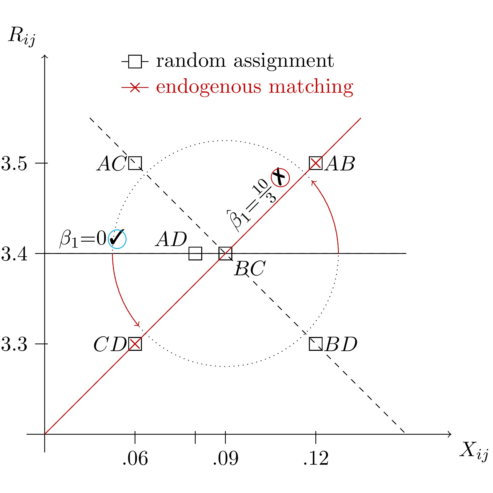

#### Sorting bias in endogenous groups

Ever worked with grouped data where group membership wasn't random? Did you correct for endogeneous matching? Here's why you should.

<!--more-->

Eh, you already know the answer? Then check out a simple correction method in <a href="https://ideas.repec.org/p/cam/camdae/1521.html">@Klein2015a</a> and the [documentation](http://cran.r-project.org/web/packages/matchingMarkets/matchingMarkets.pdf) and [vignette](https://cran.r-project.org/web/packages/matchingMarkets/vignettes/matching.pdf) <a href="https://cran.r-project.org/web/packages/matchingMarkets/vignettes/matching.pdf">[@Klein2015c]</a> to R package [`matchingMarkets`](http://cran.r-project.org/package=matchingMarkets) <a href="http://cran.r-project.org/package=matchingMarkets">[@Klein2015b]</a>. 

Still curious? So here's why: The figure below plots group outcomes ($R_{ij}$) against characteristics ($X_{ij}$) for all feasible partitions of 4 agents into groups of two ($AB$-$CD$, $AC$-$BD$, $AD$-$BD$). Underlying this example is a simple linear model where the group characteristic has no effect on outcomes, and thus $\beta=0$ (black line). If groups are assigned at random, then all 3 partitions are equiprobable and the average slope estimate is zero. If, however, group formation is endogenous, then regression coefficients will generally be biased  (red line). <!--In the example, the two agents $A$ and $B$ with better observable and unobservable characteristics form a group.-->

Read on for the algebra and R code behind the linear model in this example.




#### A simple model of group diversity

Let's start with a simple model where agent $i$'s valuation over agent $j$ is symmetric, that is $u_{i,j}=u_{j,i}$. The additive valuation of group $G$ is then given by the sum over all pairwise valuations 

$V_G = \sum_{i\in G} \sum_{j\in G\backslash i} u_{i,j}$. 

Let group valuation $V_G$ and group outcome $R_G$ dependent on a group's diversity $X$ and some error term. In a population with two types, group diversity can be thought of as the probability of two group members being of the same type. Let's further assume that everybody prefers to work with members of their own type ($\alpha=+1$) but diversified teams are more successful ($\beta=-1$).

$V_G = \alpha\cdot X_G + \eta_G$

$R_G = \beta\cdot X_G + \delta\eta_G + \xi_G$
<!--$D = 1$ if $V$ satisfies the equilibrium condition$, 0 otherwise.-->

Here, $\eta_G$ is a group's unobserved group valuation, which also affects the outcome equation for $\delta \neq 0$. Let $\eta$ capture group members' individual abilities, which have a positive effect $\delta = 0.5$ on outcomes. 
<!--with $\varepsilon_G = \delta\eta_G + \xi_G$-->
Finally, the error term $\zeta_G$ contains random shocks that affect group outcomes but are unknown at group formation. 

The endogeneity problem kicks in whenever (i) groups are not formed at random and thus $cov(X_G, \eta_G)\neq 0$ and (ii) unobserved group characteristics affect group outcomes, $\delta \neq 0$. It is resolved when we can control for the unobservable $\eta$ in the outcome equation.


#### An example using simulated data

To illustrate, let us simulate the bias from endogenous group formation and consider the solution implemented in the `matchingMarkets` package. I proceed in three steps: generation of individual-level data, transformation to group-level variables and outcomes and, finally, comparison of OLS and the correction method presented in <a href="https://ideas.repec.org/p/cam/camdae/1521.html">@Klein2015a</a>.


##### Individual-level data

The `stabsim` function simulates individual-level, independent variables. The code below generates data for `m=1,000` markets with `gpm=2` groups per market and group size `ind=5`.

```{r, cache=TRUE}
## Simulate individual-level, independent variables
library(matchingMarkets)
idata <- stabsim(m=1000, ind=5, seed=123, gpm=2)
head(idata)
```
The resulting data contains market and group identifiers `m.id` and `g.id` and the independent variable `wst`$\sim$ B(1,0.5). The dependent variable `R` depends on the error terms and is still undefined at this stage.


##### Group-level data

Next we apply the function `stabit` that serves three purposes: 

* First, it specifies the list of variables to be included in `selection` and `outcome` equations and generates group-level variables based on group members' individual characteristics. For example, the operation `ieq="wst"` produces the probability that two randomly drawn group members have the same value of `wst`.
* Second, if `simulation="NTU"`, it draws standard normal, group-level unobservables `eta` and `xi` to enter selection and outcome equation and selects equilibrium groups based on the group formation game with non-transferable utility, assuming pairwise aligned preferences as in <a href="https://ideas.repec.org/p/cam/camdae/1521.html">@Klein2015a</a>. In the case of two groups per market, this selection rule results in one dominant group with the maximum group valuation and one group comprised of the residual agents.
* Third, the argument `method="model.frame"` specifies that only the group-level model matrices be generated. Other options are estimators using `"NTU"` for selection correction using non-transferable utility matching as selection rule or `"outcome"` for estimation of the outcome equation only.

```{r, cache=TRUE, results='hide'}
## Simulate group-level variables (takes a minute to complete...)
mdata <- stabit(x=idata, simulation="NTU", method="model.frame",
                selection = list(ieq="wst"), 
                outcome   = list(ieq="wst"))$model.frame
```

The resulting object `mdata` is a list containing data for selection and outcome equations in `SEL` and `OUT`, respectively. `SEL` contains 252,000 rows, one for each of ${5 \choose 10}$ = 252 feasible groups in each of the 1,000 markets. A group's valuation is given by `V = +1*wst.ieq + eta`. The variable `D` indicates which groups are observed in equilibrium `D=1` and which are not `D=0`.

```{r, cache=TRUE}
head(mdata$SEL, 4)
```

The outcome data in `OUT` contains 2,000 rows, one for each of 2 equilibrium groups per market. The group outcome is given by `R = -1*wst.ieq + epsilon` with `epsilon := +0.5*eta + xi`.

```{r, cache=TRUE}
head(mdata$OUT, 4)
```


##### Bias from sorting

The bias in the slope estimate $\hat\beta-\beta$ = `r round(lm(R ~ wst.ieq, data=mdata$OUT)$coefficients[2],2)` - (-1) = `r round(lm(R ~ wst.ieq, data=mdata$OUT)$coefficients[2],2) - -1` is illustrated in the left panel of the figure below.
```{r, cache=TRUE}
## Naive OLS estimation
lm(R ~ wst.ieq, data=mdata$OUT)$coefficients
```
The source of this bias is the positive correlation between `epsilon` and the exogenous variable `wst.ieq` (see the right panel below).

```{r, cache=TRUE}
## epsilon is correlated with independent variables
summary(lm(epsilon ~ wst.ieq, mdata$OUT))$coefficients
```

```{r, fig.show='hold', fig.height=3, echo=FALSE, cache=TRUE}
## http://rstudio-pubs-static.s3.amazonaws.com/7024_e3a68a9b35454e74abfe15b621c50502.html
library(ggplot2)
library(gridExtra)

lm1 <- lm(epsilon*0.5 ~ wst.ieq, data=mdata$OUT)
conf.int <- data.frame(with(mdata$OUT, cbind(wst.ieq, predict(lm1, newdata=mdata$OUT, 
interval="confidence", level=.95))))
errors <- ggplot(conf.int, aes(x = wst.ieq, y = fit)) +
  ggtitle(expression(paste("Correlation of X and ", delta*eta, ""))) +
  geom_smooth(data = conf.int, aes(ymin = lwr, ymax = upr), stat = "identity") +
  labs(y = expression(delta * eta), x = expression(X)) 

lm2 <- lm(R ~ wst.ieq, data=mdata$OUT)
lm2$coefficients["wst.ieq"] <- lm2$coefficients["wst.ieq"] + 1 ## !!
conf.int <- data.frame(with(mdata$OUT, cbind(wst.ieq, predict(lm2, newdata=mdata$OUT, interval="confidence", level=.95))))
predictions <- ggplot(conf.int, aes(x = wst.ieq, y = fit)) +
  ggtitle("Positive sorting bias") +
  geom_smooth(data = conf.int, aes(ymin = lwr, ymax = upr), stat = "identity") +
  labs(y = expression(hat(R)-R), x = expression(X)) 
  
grid.arrange(predictions, errors, ncol = 2)
``` 

An analytical example and a formal treatement of this bias is available in <a href="https://ideas.repec.org/p/cam/camdae/1521.html">@Klein2015a</a>.
We know that `epsilon = 0.5*eta + xi`. Thus, conditional on `eta`, the unobservables in the outcome equation are independent of the exogenous variables (because `xi` does not enter the selection equation). 

```{r, cache=TRUE}
## xi is uncorrelated with independent variables
summary(lm(xi ~ wst.ieq, mdata$OUT))$coefficients
```


##### Correction of sorting bias

The selection problem is resolved when the residual from the selection equation `eta` is controlled for in the outcome equation.

```{r, cache=TRUE}
## 1st stage: obtain fitted value for eta
lm.sel <- lm(V ~ -1 + wst.ieq, data=mdata$SEL); lm.sel$coefficients
eta <- lm.sel$resid[mdata$SEL$D==1]
## 2nd stage: control for eta
lm(R ~ wst.ieq + eta, data=mdata$OUT)$coefficients
```

The figure below plots the bias from sorting against the independent variable, for the naive OLS and the selection-correction from the structural model.

```{r, fig.show='hold', fig.height=3, echo=FALSE, cache=TRUE}
## http://rstudio-pubs-static.s3.amazonaws.com/7024_e3a68a9b35454e74abfe15b621c50502.html
library(ggplot2)

lm1 <- lm(R ~ wst.ieq, data=mdata$OUT)
lm1$coefficients["wst.ieq"] <- lm1$coefficients["wst.ieq"] + 1 ## !!
conf.int1 <- data.frame(with(mdata$OUT, cbind(wst.ieq, predict(lm1, newdata=mdata$OUT, interval="confidence", level=.95))))

lm2 <- lm(R ~ wst.ieq + eta, data=mdata$OUT)
lm2$coefficients["wst.ieq"] <- lm2$coefficients["wst.ieq"] + 1 ## !!
conf.int2 <- data.frame(with(mdata$OUT, cbind(wst.ieq, predict(lm2, newdata=mdata$OUT, interval="confidence", level=.95))))
conf.int2[,2:4] <- apply(conf.int2[,2:4], 2, function(i) i - lm2$coefficients["eta"]*eta)

conf.int <- rbind(conf.int1, conf.int2)
conf.int$model <- c(rep("OLS",dim(conf.int1)[1]), rep("Structural",dim(conf.int2)[1]))

ggplot(conf.int, aes(x = wst.ieq, y = fit, colour=model)) +
  ggtitle("OLS and bias corrected estimates") +
  geom_smooth(data = conf.int, aes(ymin = lwr, ymax = upr), stat = "identity") +
  labs(y = expression(hat(R)-R), x = expression(X)) 
``` 


In most real-world applications, however, the match valuations `V` are unobserved. The solution is to estimate the selection equation by imposing equilibrium bounds, as derived in <a href="https://cran.r-project.org/web/packages/matchingMarkets/vignettes/matching.pdf">@Klein2015c</a>.


#### References


<!--
library(knitr)
knit("~/Documents/Sites/thiloklein.github.io/_knitr/2015-06-08-matchingMarkets.Rmd", "~/Documents/Sites/thiloklein.github.io/_posts/2015-06-08-matchingMarkets.md") 
replace ```r ``` with  
sudo jekyll serve --watch
-->


