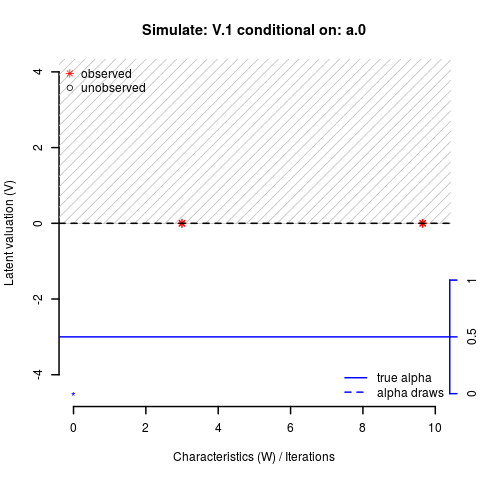

#### Causal inference from endogenous groups

This post builds on my previous post on [sorting bias in endogenous groups](http://klein.uk/blog/2015/07/matchingMarkets2/) to ilustrate a method to draw causal inference from endogenously formed groups.<!--more-->

In my previous post, I had shown the endogeneity problem that arises from matching into groups and how it can be resolved by controlling for unobservables that affect both group formation and outcomes.

This post illustrates a method that helps to estimate these unobservales and, at the same time, provides a source of exogenous variation to identify the parameters in the group outcome equation. The method is applied in <a href="https://ideas.repec.org/p/cam/camdae/1521.html">@Klein2015a</a> and documented in the vignette <a href="https://cran.r-project.org/web/packages/matchingMarkets/vignettes/matching.pdf">[@Klein2015c]</a> to R package [`matchingMarkets`](http://cran.r-project.org/package=matchingMarkets) <a href="http://cran.r-project.org/package=matchingMarkets">[@Klein2015b]</a>.


#### Estimation

The method relies on the assumption that groups are in equilibrum. In a non-transferable utility context with aligned preferences, this results in a very simple equilibrium condition for two-group markets: the group with the maximum group valuation must be in equilibrium [see <a href="https://ideas.repec.org/p/cam/camdae/1521.html">@Klein2015a</a>].

This equilibrium condition can be restated in two simple inequalities:

- `lower bounds` for equilibrium groups: the match valuation of one of the two equilibrium groups must larger than that of all non-equilibrium groups. 
- `upper bounds` for non-equilibrium groups: the match valuation of each non-equilibrium group must be lower than the maximum of the equilibrium groups.  

I use the data augmentation approach, proposed by @Albert1993, which treats the latent valuations as parameters. The Gibbs sampling method for matching model `V = alpha*W + eta` iteratively simulates draws for the four parameter blocks: 

1. the match valuation `V` for non-equilibrium groups (black circles),
2. the match valuation `V` for the first equilibrium group (red asterisk to right),
3. the match valuation `V` for the second equilibrium group (red asterisk to left), and
4. the regression coefficient `alpha` (blue dashed line). 

<!--See the [CRAN website](http://cran.r-project.org/package=matchingMarkets) for package documentation and installation instructions.
R package matchingMarkets implements structural estimators to correct for the sample selection bias from observed outcomes in matching markets. -->



The start values in the simulation above are: `V = alpha = 0`. The parameter draws for `V` are standard normal with the conditional mean given by the back, dashed line. Draws are restricted by the two inequalities derived from the equilibrium condition above: 

- `grey shades` indicate upper or lower bounds imposed on the current draw(s)
- `yellow shades` indicate that no bounds are imposed because the valuation of one equilibrium group is higher than that of the highest non-equilibrium group (and therefore the equilibrium condition is met for any value of the draw).

See my GitHub page for the gif's [source code](https://github.com/thiloklein/thiloklein.github.io/blob/master/viz/matching/simmatch.R).

#### Identification

The Gibbs sampling algorithm is computationally complex but the bounds provide a valuable source of exogenous variation, which <a href="https://ideas.repec.org/p/cam/camdae/1521.html">@Klein2015a</a> uses to correct for endogenous group formation. 

The identifying exclusion restriction is that the equilibrium bounds depend on the characteristics of all agents in the market, but the performance of a matched group is determined only by its own members.


#### References

<!--
library(knitr)
knit("~/Documents/Sites/thiloklein.github.io/_knitr/2015-06-08-matchingMarkets.Rmd", "~/Documents/Sites/thiloklein.github.io/_posts/2015-06-08-matchingMarkets.md") 
replace ```r ``` with  
sudo jekyll serve --watch
-->
