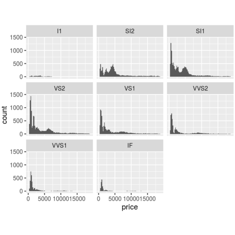
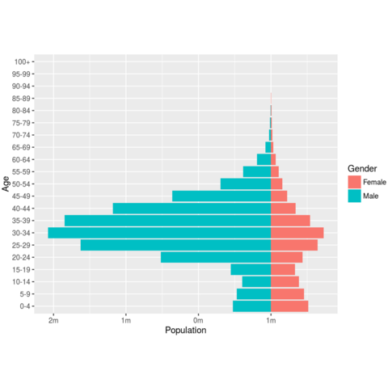
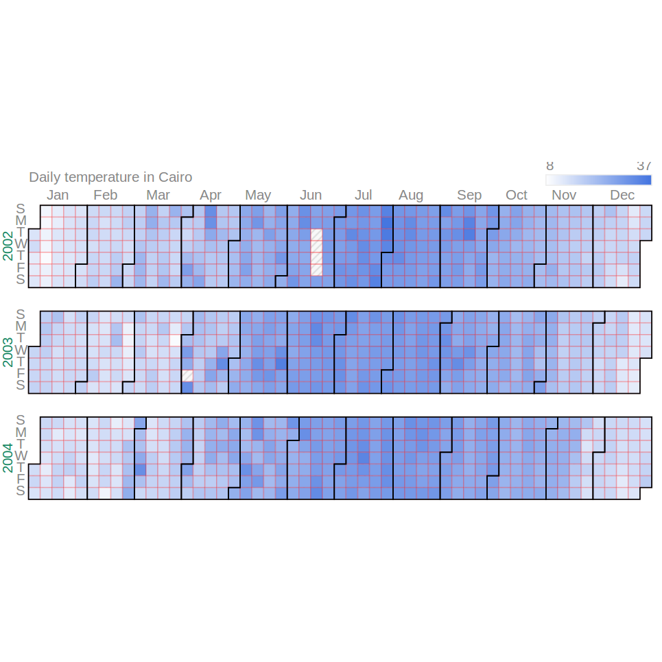
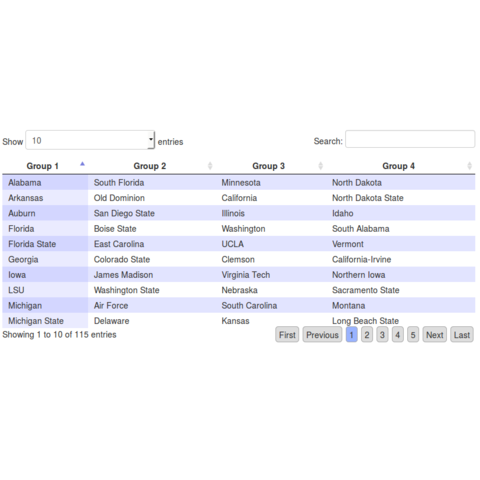

## Data Visualisation

To make full use of the development data revolution, statisticians must take advantage of technological advancement and innovative approaches to data collection, analysis and dissemination to improve the way they analyse and disseminate statistics and thereby encourage wider use of statistics. 

[PARIS21](http://www.paris21.org) is committed to help statistical systems to improve their data dissemination practices as a means of promoting evidence-based policy-making and decisions at the country level. With the aim of sustaining the capacity building program for statistical systems, PARIS21 partners with national and regional institutions in training activities on data communication and visualisation.  

The workshops serve as a venue for collaboration between statisticians to adopt the data visualisation tools and ensure wider use in the statistical system. To tailor the content to local training requirements, participants are invited to take a short [pre-course survey](survey/index.html).

***

#### Galleries
<footer class="row-fluid">
				<article class="span3">
					<header>
						<div class="thumbnail"></div>
						<hgroup>
							<h5>
								<a href="datavis-ggplot2/index.html">ggplot2</a>
							</h5>
						</hgroup>
					</header>
					<div class="content">
<p>The <a href="http://docs.ggplot2.org/current/">ggplot2</a> package is a plotting system for R, based on the grammar of graphics, which tries to take the good parts of base and lattice graphics and none of the bad parts.</p>
</p>
					</div>
					<footer>
						<p><a href="datavis-ggplot2/index.html" class="btn">Learn more &raquo;</a></p>
						<br>
					</footer>
				</article><!--/span-->


				<article class="span3">
					<header>
						<div class="thumbnail"></div>
						<hgroup>
							<h5>
								<a href="datavis-maps/index.html">maps</a>
							</h5>
						</hgroup>
					</header>
					<div class="content">
<p>Examples of plotting region-level data on country maps using the <a href="http://docs.ggplot2.org/current/">ggplot2</a> package and shape files from <a href="http://gadm.org">gadm.org</a>.</p>
</p>
					</div>
					<footer>
						<p><a href="datavis-maps/index.html" class="btn">Learn more &raquo;</a></p>
						<br>
					</footer>
				</article><!--/span-->


				<article class="span3">
					<header>
						<div class="thumbnail"></div>
						<hgroup>
							<h5>
								<a href="datavis-pyramids/index.html">population pyramids</a>
							</h5>
						</hgroup>
					</header>
					<div class="content">
<p>Examples of static and interactive population pyramids using the packages <a href="http://docs.ggplot2.org/current/">ggplot2</a> and <a href="http://rcharts.io">rCharts</a> and population data from <a href="http://www.census.gov/population/international/data/idb/informationGateway.php">census.gov</a>.</p>
</p>
					</div>
					<footer>
						<p><a href="datavis-pyramids/index.html" class="btn">Learn more &raquo;</a></p>
						<br>
					</footer>
				</article><!--/span-->


				<article class="span3">
					<header>
						<div class="thumbnail"></div>
						<hgroup>
							<h5>
								<a href="/blog/2015/08/dataviz/index.html">googleVis</a>
							</h5>
						</hgroup>
					</header>
					<div class="content">
<p>The <a href="https://cran.r-project.org/web/packages/googleVis/vignettes/googleVis_examples.html">googleVis</a> package provides an interface to <a href="https://developers.google.com/chart/interactive/docs/gallery?hl=en">Google Charts API</a>, allowing users to create interactive charts based on R data frames.</p>
</p>
					</div>
					<footer>
						<p><a href="/blog/2015/08/dataviz/index.html" class="btn">Learn more &raquo;</a></p>
						<br>
					</footer>
				</article><!--/span-->

</footer>


<footer class="row-fluid">
				<article class="span3">
					<header>
						<div class="thumbnail"></div>
						<hgroup>
							<h5>
								<a href="/blog/2015/08/dataviz/index.html">rMaps</a>
							</h5>
						</hgroup>
					</header>
					<div class="content">
<p>The <a href="http://rmaps.github.io">rMaps</a> package makes it easy to create, customize and share interactive maps from R, with a few lines of code. It supports several javascript based mapping libraries like Leaflet, DataMaps and Crosslet.</p>
</p>
					</div>
					<footer>
						<p><a href="/blog/2015/08/dataviz/index.html" class="btn">Learn more &raquo;</a></p>
					</footer>
				</article><!--/span-->


				<article class="span3">
					<header>
						<div class="thumbnail"></div>
						<hgroup>
							<h5>
								<a href="/blog/2015/08/dataviz/index.html">rCharts</a>
							</h5>
						</hgroup>
					</header>
					<div class="content">
<p>The <a href="http://rcharts.io">rCharts</a> package allows you to create, customize and publish interactive javascript visualisations from R using a <a href="http://www.statmethods.net/advgraphs/trellis.html">lattice</a> style plotting interface.</p>
</p>
					</div>
					<footer>
						<p><a href="/blog/2015/08/dataviz/index.html" class="btn">Learn more &raquo;</a></p>
					</footer>
				</article><!--/span-->

</footer>

<!--		
  	<section class="span3">
		    <h5>ggvis</h5>
				<p>The <a href="http://ggvis.rstudio.com/">ggvis</a> package is a data visualisation package for R which lets you create rich interactive graphics with a syntax similar in spirit to ggplot2. </p>
		</section>
-->

***

#### Course material

<TABLE WIDTH="100%"> 
<TR>
<TH align="center" WIDTH="15%">Time </TH>
<TH align="left" WIDTH="60%">Session  </TH>
<TH align="left" WIDTH="25%">Resources  </TH>
</TR>
<TR bgcolor="#f0f0f0">
<TD valign="top" align="center">11:00 - 12:00 </TD>
<TD ><b>1. Examples and Overview of Tools for Data Visualisations</b>
<ul>
    <li>Good examples of data visualisations on stats office websites</li>
    <li>Tools for data visualisation</li>
    <li>The R software: An open source interface to the most popular data visualisation packages</li>
</ul>
</TD>
<TD valign="top"> <a href="docs/DataViz_1_overview.pdf">Slides</a> <br>
<a href="docs/project/permanent/3_R/pizza.R">pizza.R</a> </TD>
</TR>
<TR >
<TD valign="top" align="center">13:30 - 14:30</TD>
<TD ><b>2. Best Practices for Data Visualisations</b>
<ul>
    <li>Properties of good graphs</li>
    <li>Statistical workflow</li>
    <li>A brief introduction to R</li>
</ul>
</TD>
<TD valign="top"> <a href="docs/DataViz_2_best_practices.pdf">Slides</a> </TD>
</TR>
<TR bgcolor="#f0f0f0">
<TD align="center">14:45 - 16:00 </TD>
<TD ><b>3. Workflow of Statistical Data Analysis: A Demonstration </b>
<ul>
    <li>Setting up your project structure</li>
    <li>Data manipulation and preparation</li>
    <li>Importing your data from any format into R</li>
    <li>Creating maps with package ggplot2</li>
</ul>
</TD>
<TD valign="top"> <a href="https://www.rstudio.com/wp-content/uploads/2015/03/ggplot2-cheatsheet.pdf">ggplot2 cheatsheet</a> </TD>
</TR>
<TR >
<TD valign="top" align="center">16:15 - 17:15</TD>
<TD ><b>4. Hands-on Breakout Sessions: Interactive Data Visualisations</b>
<ul>
    <li>Formation of groups of 2-4</li>
    <li>Data preparation and generation of visuals with R packages</li>
    <li>Visuals to be covered: Data tables, bar and pie charts; Population pyramids; Tree maps; Motion charts; Calendar charts</li>
</ul>
</TD>
<TD valign="top"> <a href="docs/DataViz_3_group_work.pdf">Slides</a> </TD>
</TR>
<TR bgcolor="#f0f0f0">
<TD valign="top" align="center">09:00 - 10:15</TD>
<TD ><b>5. Interactive reports</b>
<ul>
    <li>Report writing</li>
    <li>Websites and interactive graphs</li>
    <li>Application to tree maps and HIES data</li>
</ul>
</TD>
<TD valign="top"> <a href="docs/DataViz_4_reports.pdf">Slides</a> <br> 
<a href="docs/project.zip">project.zip</a> <br>
<a href="https://www.rstudio.com/wp-content/uploads/2015/02/rmarkdown-cheatsheet.pdf">rmarkdown cheatsheet</a>  </TD>
</TR>

<TR >
<TD valign="top" align="center">10:30 - 11:45</TD>
<TD ><b>6. Hands-on Breakout Sessions (cont'd)</b>
<ul>
    <li>Preparation of presentations</li>
</ul>
</TD>
<TD valign="top">--</TD>
</TR>

<TR bgcolor="#f0f0f0">
<TD valign="top" align="center">13:30 - 15:00</TD>
<TD ><b>7. Hands-on Breakout Sessions (cont'd)</b>
<ul>
    <li>Group presentations</li>
</ul>
</TD>
<TD valign="top">--</TD>
</TR>


<TR >
<TD valign="top" align="center">15:15 - 16:30</TD>
<TD ><b>8. Next Steps: Finding Help and Resources</b>
<ul>
    <li>Unstructured resources: <a href="http://stackoverflow.com/">Stackoverflow</a>, <a href="http://stackexchange.com/">Stackexchange</a> and other online forums</li>
    <li>Structured resources: <a href="http://rcharts.io/gallery/">Galleries</a> and <a href="http://flowingdata.com/category/tutorials/">tutorials</a> and examples on how to use them</li>
    <li>Regional and local resources: <a href="http://data-visualization.meetup.com/">Data Visualisation Meetups</a> and local <a href="http://blog.revolutionanalytics.com/local-r-groups.html">R User Groups</a></li>
</ul>
</TD>
<TD valign="top"> <a href="docs/DataViz_5_resources.pdf">Slides</a> </TD>
</TR>
</TABLE>


***

#### Software

For the lab sessions we will use the open source software environment R. I think that it is helpful to coordinate on one environment. R has the advantage of being free and rather powerful. Read about R in this New York Times [article](http://www.nytimes.com/2009/01/07/technology/business-computing/07program.html?_r=1).

***

##### R 

* Download and install R from [r-project.org](http://www.r-project.org):
     + Under `Download` on left side, click: `CRAN`
     + Choose a local mirror in the UK, e.g., London or Bristol.
     + Choose platform, e.g. Windows, Linux or OSX (MAC)
     + Under Windows, select `base` (Binaries for base distribution)
     + Click `Download R 3.2.3 for Windows` (62 megabytes) to save and run Setup program: R-3.2.3-win62.exe
* Documentation for R is provided via the build in `help` or `??` (use, for example, `help("plot")` or `??plot` in the console) but also through the [R manual Homepage](https://stat.ethz.ch/R-manual/R-devel/doc/html/packages.html). Useful tools from the CRAN project are [An Introduction to R](https://cran.r-project.org/doc/manuals/R-intro.pdf) and the [R Reference Card](https://cran.r-project.org/doc/contrib/Short-refcard.pdf). Other manuals are available on the website.
* If you are new to R, I recommend working through W.J. Owen's [R tutorial](https://cran.r-project.org/doc/contrib/Owen-TheRGuide.pdf). It is easy to read and tries to explain R with the help of examples from basic statistics.

<!--
* The R Commander allows an easy start with R using mouse and menu. Install the commander by typing `install.packages("Rcmdr")` and load it in the active workspace `library(Rcmdr)`. You can run the Commander by typing `Commander()` in the console.
-->

***

##### RStudio

I also recommend using RStudio as a front end.

* Download and install RStudio from [rstudio.com](https://www.rstudio.com):
    + In the homepage, click : `Download RStudio`
    + Under `RStudio Desktop`, select the Open Source Edition and click `Download RStudio Desktop` 
    + Under "Installers for Supported Platforms", select `Windows Vista/7/8/10`
    + Open the document in your download file and follow the instruction for installation.    
* To update an older version of RStudio
    1. Via the web: The latest stable versions of RStudio Desktop and Server can be found 
[here](http://www.rstudio.com/products/rstudio/).
    2. Via RStudio: You can also check for new versions of RStudio within RStudio. Go to the `Help` menu and click `Check for Updates`. This is the most conservative method to look for updates; new versions are posted to the web site frequently, but RStudio support team does not advertise them to existing installations as often.


***

##### Rtools

Many of the packages require that you have [Rtools](https://cran.r-project.org/bin/windows/Rtools/) installed in addition to base R. 

***

##### R Packages

To get the latest stable version of a package from CRAN:

```
install.packages("packagename")
library(packagename)
```

To get the most recent development version of a package from GitHub:

```
install.packages("devtools")
devtools::install_github("author/packagename")
library(packagename)
```

For example, to use the [rCharts](http://rcharts.io/gallery/) and [rMaps](http://rmaps.github.io) packages, you do

```
devtools::install_github("author/packagename")
install_github('ramnathv/rCharts')
install_github('ramnathv/rMaps')
library(rCharts)
library(rMaps)
```


